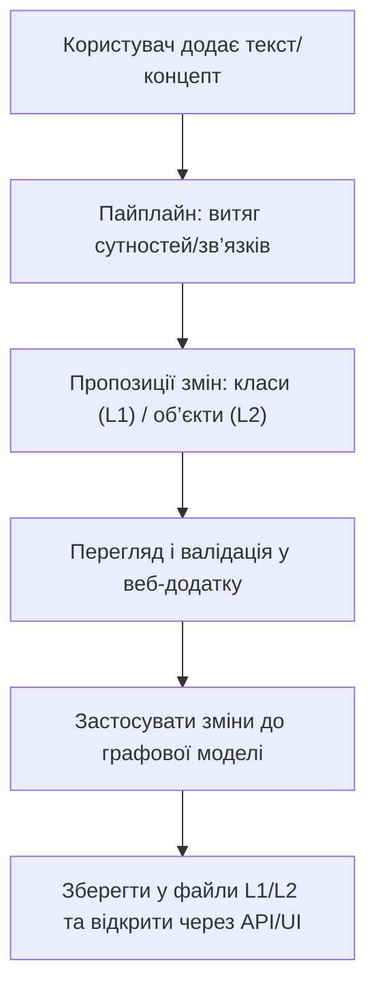

## 1. Огляд продукту
Система перетворює текст(и) користувача у графову модель: класи (абстракції) та конкретні об’єкти з їхніми властивостями і зв’язками.
- Цільові користувачі: аналітики, інженери знань, розробники, що структурують доменну інформацію з текстових описів
- Цінність: швидке побудування та перевірка онтології/схеми (рівень 1) і фактичних даних (рівень 2) з прозорою візуалізацією та керованим API

## 2. Ключові можливості

### 2.1 Ролі користувачів
| Роль | Спосіб входу | Основні права |
|------|--------------|---------------|
| Користувач | Без авторизації (MVP) | Перегляд рівнів 1–2, пошук, створення/редагування через UI та API |
| Адміністратор (опційно) | Базова авторизація (пізніше) | Керування сховищами, політиками LLM, аудит змін |

### 2.2 Модулі продукту
1. **Пайплайн знань (LLM/парсер)**: з тексту пропонує/перевіряє/модифікує класи та об’єкти, ініціалізує екземпляри
2. **Реєстр абстракцій**: зберігання, пошук і версіонування рівня 1 (класи, їхні властивості, зв’язки між класами)
3. **Реєстр об’єктів**: зберігання і керування рівнем 2 (екземпляри, значення властивостей, зв’язки між об’єктами)
4. **REST API**: створення/оновлення/пошук класів та об’єктів, робота з властивостями, збереження/завантаження у файли
5. **Веб-додаток**: перегляд рівня 1 і рівня 2, пошук, деталізація, візуалізація зв’язків, ручна валідація змін

### 2.3 Деталі сторінок
| Назва сторінки | Модуль | Опис функціоналу |
|---------------|--------|------------------|
| Огляд | Навігація/стан | Перемикач “Рівень 1 / Рівень 2”, пошук за назвою, швидкі дії імпорт/експорт |
| Рівень 1 | Класи | Список класів, фільтри, картка класу (властивості/зв’язки), граф класів |
| Рівень 2 | Об’єкти | Список об’єктів, фільтри, картка об’єкта (значення/зв’язки), граф об’єктів з підсвіткою типів |
| Імпорт тексту | Пайплайн | Поле введення/завантаження тексту, запуск “згенерувати/перевірити”, попередній перегляд дифів, застосування змін |

## 3. Основний процес
Користувач надає концепт-файл (опційно) і/або довільний текст. Система формує пропозиції щодо класів/об’єктів, показує зміни, користувач підтверджує, після чого модель зберігається та доступна через UI/API.

## 4. Дизайн інтерфейсу
### 4.1 Стиль
- Тема: темний фон + контрастні “неонові” акценти для ребер/типів, читабельна типографіка для таблиць властивостей
- Компоненти: ліва панель пошуку/фільтрів, центральна область графу, права панель деталей
- Взаємодії: hover-підсвітка суміжних вузлів/ребер, клік по вузлу відкриває деталі, зум/панорама

### 4.2 Огляд дизайну сторінок
| Сторінка | Модуль | UI-елементи |
|---------|--------|-------------|
| Рівень 1 | Граф класів | Граф, легенда типів зв’язків, список класів, панель властивостей |
| Рівень 2 | Граф об’єктів | Граф, фільтр за класом/тегами, список об’єктів, панель значень |
| Імпорт тексту | Диф перегляд | Вкладки “Класи / Об’єкти”, diff-таблиця, кнопка “Застосувати” |

### 4.3 Адаптивність
Desktop-first, мобільно-адаптивно: на малих екранах панелі стають вкладками, граф на всю ширину.

## 5. Функціональні вимоги (MVP)
- Створення/оновлення/видалення класів (L1) з властивостями та зв’язками між класами
- Створення/оновлення/видалення об’єктів (L2) з присвоєнням класу(ів), значеннями властивостей і зв’язками між об’єктами
- Пошук за назвою для класів і об’єктів
- Експорт/імпорт у файли для рівня 1 та рівня 2
- Візуалізація зв’язків у веб-додатку (окремо для рівнів 1 і 2)
- API для:
  - створення класів/об’єктів
  - додавання/читання властивостей
  - пошуку властивостей/зв’язків
  - створення/пошуку/модифікації конкретних об’єктів

## 6. Нефункціональні вимоги
- Відсутність логування секретів (API-ключів LLM)
- Валідація вхідних даних (схеми запитів)
- Відтворюваність: модель повністю відновлюється з файлів L1/L2
- Масштабування: принаймні кілька тисяч вузлів у граф-візуалізації (з обмеженням для браузера)

## 7. Припущення та відкриті питання
- “Файл концепту” може бути у форматі Markdown/текст/JSON; потрібен приклад, щоб формалізувати парсер
- LLM-інтеграція в MVP реалізується як адаптер із режимом “dry-run” (лише пропозиції), без обов’язкової зовнішньої залежності
