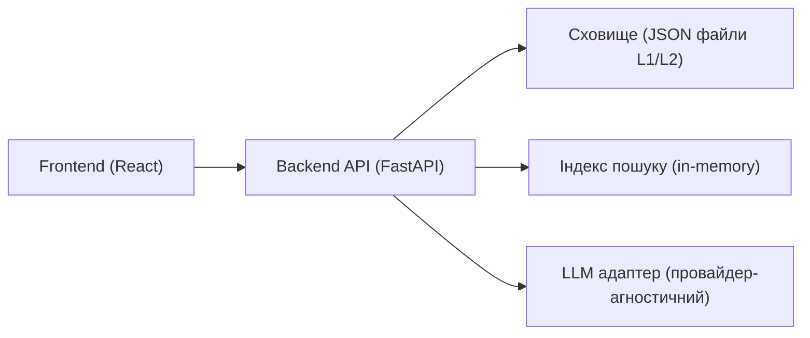
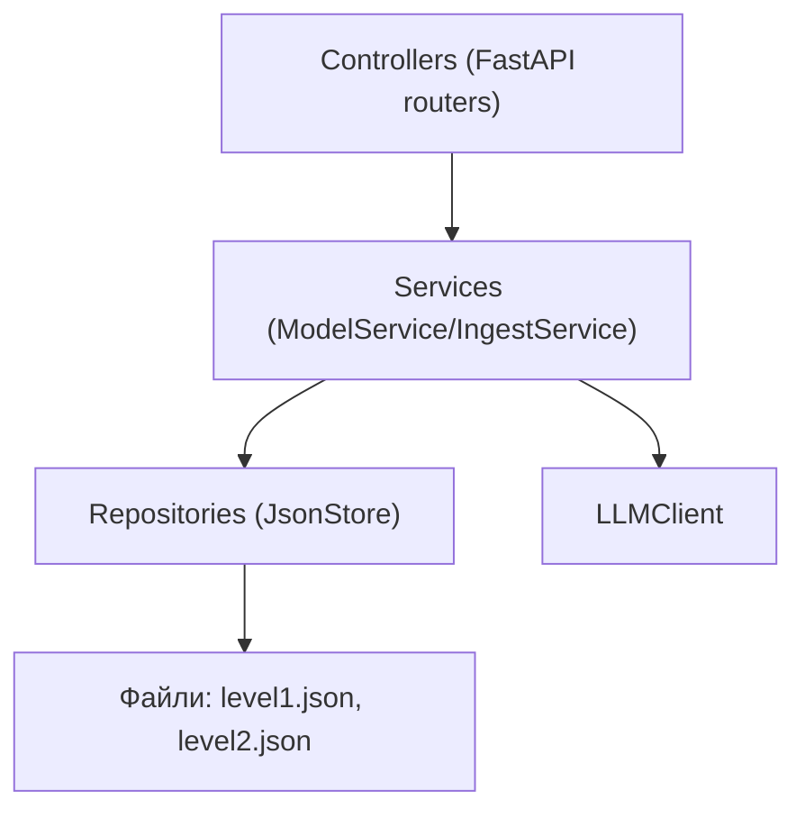
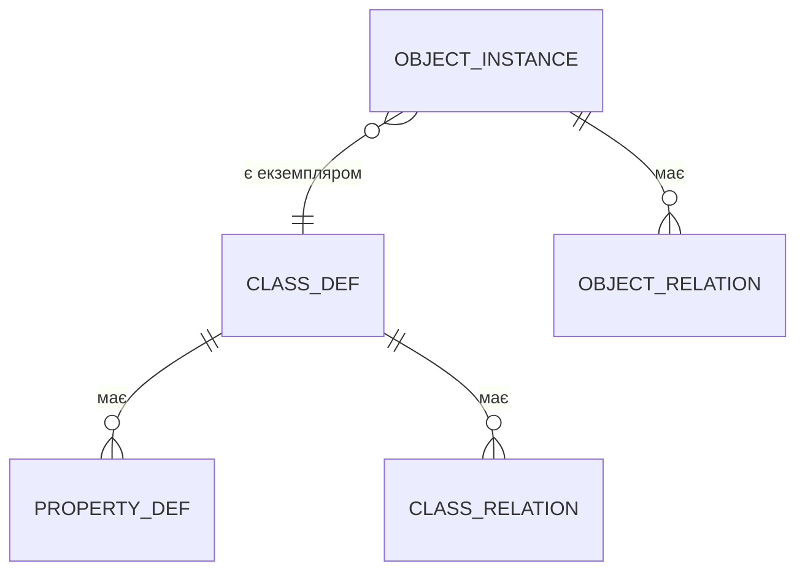

## 1. Дизайн архітектури

## 2. Опис технологій
- Frontend: React@18 + vite + tailwindcss
- Backend: Python + FastAPI + pydantic
- Сховище: JSON файли (MVP) з чіткими схемами `level1.json` і `level2.json`
- Граф-візуалізація: Cytoscape.js (MVP)
- LLM: абстракція `LLMClient` з реалізаціями:
  - `NullLLM` (без мережі, повертає “не підтримується” або мок-результати)
  - `OpenAICompatibleLLM` (опційно, за наявності ключа у змінній середовища)

## 3. Визначення маршрутів (Frontend)
| Route | Призначення |
|-------|-------------|
| / | Огляд, перемикач рівнів, глобальний пошук |
| /level-1 | Перегляд класів і графу зв’язків класів |
| /level-2 | Перегляд об’єктів і графу зв’язків об’єктів |
| /ingest | Імпорт тексту, preview/diff, застосування змін |

## 4. Визначення API (Backend)

### 4.1 Типи (концептуально)
- `ClassDef` (рівень 1): `name`, `properties[]`, `relations[]`
- `PropertyDef`: `name`, `type`, `required`, `description?`
- `RelationDef` (між класами): `name`, `from_class`, `to_class`, `cardinality?`
- `ObjectInstance` (рівень 2): `name`, `class_name`, `properties{}`, `relations[]`
- `ObjectRelation` (між об’єктами): `name`, `from_object`, `to_object`

### 4.2 Ендпоїнти (MVP)
| Метод | Шлях | Опис |
|------|------|------|
| GET | /health | Перевірка працездатності |
| GET | /level-1/classes | Список класів (фільтр: q=) |
| POST | /level-1/classes | Створити клас |
| GET | /level-1/classes/{name} | Отримати клас |
| PATCH | /level-1/classes/{name} | Модифікувати клас (властивості/зв’язки) |
| DELETE | /level-1/classes/{name} | Видалити клас |
| GET | /level-2/objects | Список об’єктів (фільтр: q=, class=) |
| POST | /level-2/objects | Створити об’єкт |
| GET | /level-2/objects/{name} | Отримати об’єкт |
| PATCH | /level-2/objects/{name} | Модифікувати об’єкт (значення/зв’язки) |
| DELETE | /level-2/objects/{name} | Видалити об’єкт |
| POST | /ingest/text | Прийняти текст, повернути “пропозиції” (diff) для L1/L2 |
| POST | /ingest/apply | Застосувати пропозиції до поточної моделі |
| POST | /storage/save | Зберегти L1/L2 у файли |
| POST | /storage/load | Завантажити L1/L2 з файлів |

## 5. Діаграма серверної архітектури

## 6. Модель даних

### 6.1 Визначення (графовий погляд)

### 6.2 Формат файлів (MVP)
- `level1.json`: `{ "classes": [ClassDef...] }`
- `level2.json`: `{ "objects": [ObjectInstance...] }`
- Імена (name) у межах свого простору унікальні; зв’язки посилаються на `name`

## 7. Нотатки щодо “файлу концепту”
- Якщо концепт-файл вже містить формальну структуру (JSON/YAML), бекенд може завантажувати його напряму в `level1.json`.
- Якщо концепт-файл — текст/Markdown, використовується парсер правил (regex/шаблони) або LLM для отримання `ClassDef`.
